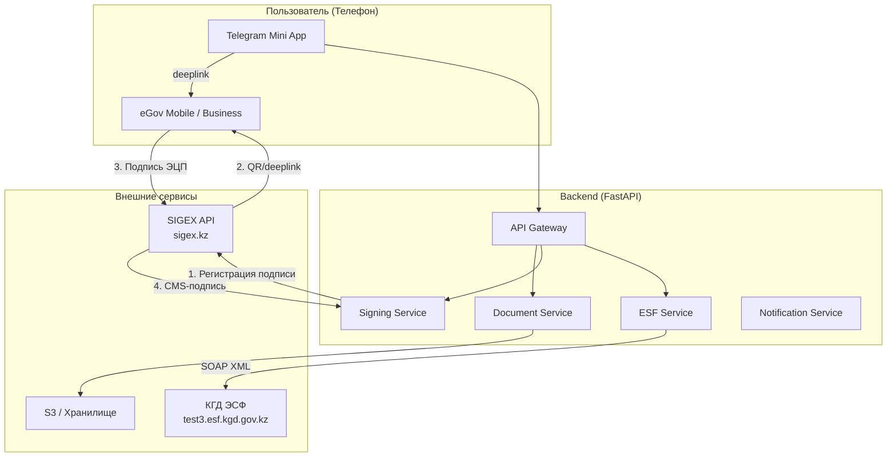
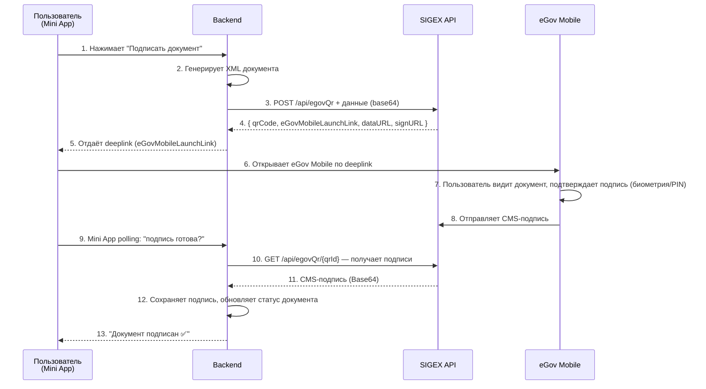
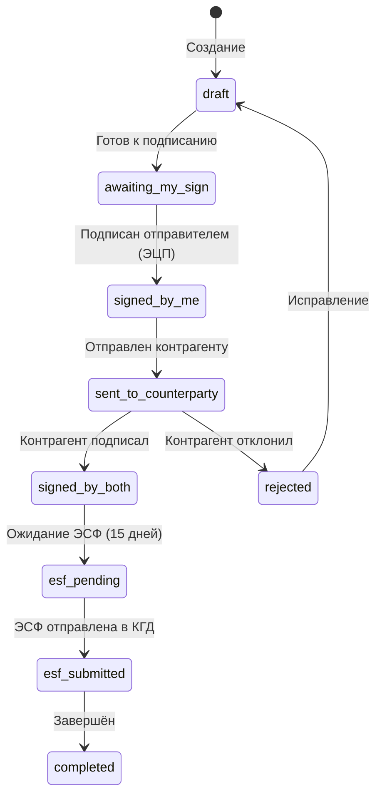
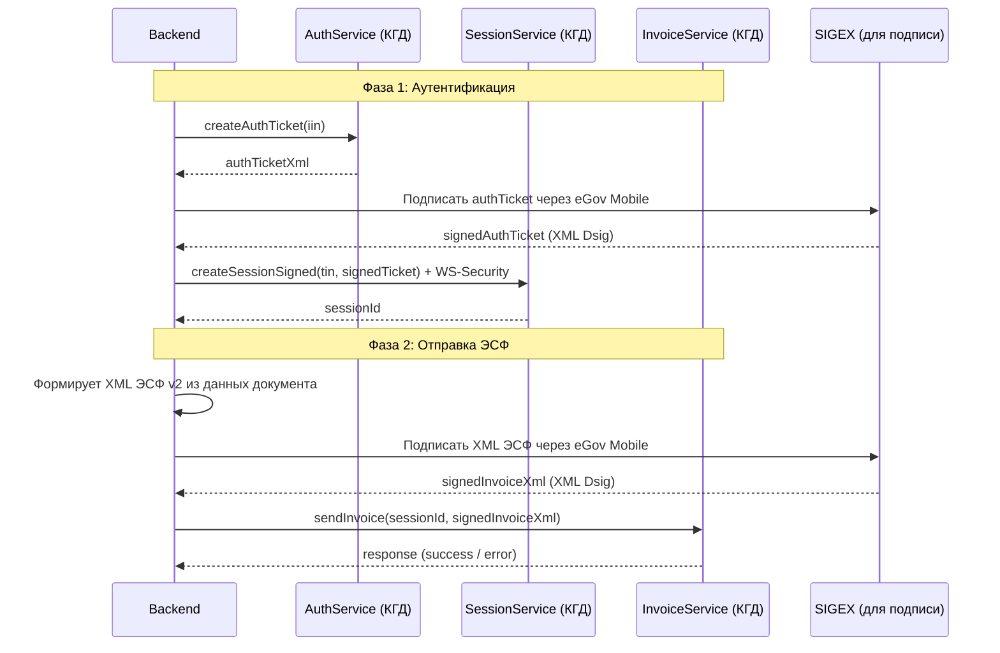
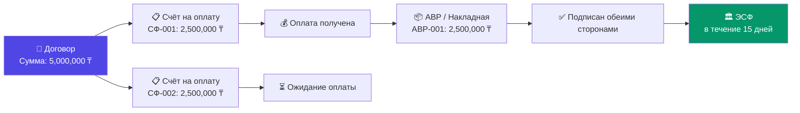

# 🏗️ Полный план внедрения ЭДО + ЭСФ в Doc Mini App

> **Цель**: Превратить приложение из генератора документов в полноценную ЭДО-систему с юридически значимым электронным документооборотом, ЭЦП-подписанием через eGov Mobile и автоматической отправкой ЭСФ в налоговую (КГД РК).

---

## 📋 Оглавление

1. [Общая архитектура системы](#1-общая-архитектура-системы)
2. [Как работает подписание через eGov Mobile](#2-как-работает-подписание-через-egov-mobile)
3. [Жизненный цикл документа в ЭДО](#3-жизненный-цикл-документа-в-эдо)
4. [Как работает ЭСФ и отправка в налоговую](#4-как-работает-эсф-и-отправка-в-налоговую)
5. [Привязка к договору и автоматизация цепочки](#5-привязка-к-договору-и-автоматизация-цепочки)
6. [Превью подписанных документов и визуализация ЭЦП](#6-превью-подписанных-документов-и-визуализация-эцп)
7. [Входящие и Исходящие документы](#7-входящие-и-исходящие-документы)
8. [Гостевое окно для контрагентов](#8-гостевое-окно-для-контрагентов)
9. [Поэтапный план внедрения](#9-поэтапный-план-внедрения)
10. [Техническая реализация (детали)](#10-техническая-реализация-детали)

---

## 1. Общая архитектура системы

### Схема взаимодействия компонентов



### Ключевые принципы
- **Подписание ТОЛЬКО через eGov Mobile** — так как пользователь на телефоне через Telegram Mini App, NCALayer невозможен
- **SIGEX как посредник** — отвечает за генерацию QR и deeplink, получение подписи от eGov Mobile
- **Backend хранит всё** — XML документы, подписи, хеши, метаданные
- **Тестовый сервер КГД** — `test3.esf.kgd.gov.kz:8443` для разработки, потом переключение на прод

---

## 2. Как работает подписание через eGov Mobile

### Пошаговый процесс (для мобильного устройства — одно устройство)



### Критически важно для Mini App в Telegram:
- **Используем deeplink**, а НЕ QR-код (так как пользователь уже на телефоне)
- Deeplink вида: `egov-mobile://...` открывает eGov Mobile прямо с телефона
- После подписания пользователь возвращается в Telegram
- Backend делает **long-polling** к SIGEX для получения подписи

### Два формата подписи:
| Формат | Когда используется | Описание |
|--------|-------------------|-----------|
| **CMS (PKCS#7)** | Подписание документов (АВР, НКЛ) | Подпись хранится отдельно от документа |
| **XML Dsig** | Аутентификация в ИС ЭСФ, подписание ЭСФ XML | Подпись встраивается внутрь XML |

---

## 3. Жизненный цикл документа в ЭДО

### Полная цепочка от создания до архива



### Статусы документа в системе:

| Статус | Иконка | Описание |
|--------|--------|----------|
| `draft` | 📝 | Черновик, ещё не подписан |
| `awaiting_sign` | ⏳ | Ожидает подписания ЭЦП |
| `signed_self` | ✍️ | Подписан мной, ожидает отправки |
| `sent` | 📤 | Отправлен контрагенту |
| `signed_both` | ✅✅ | Подписан обеими сторонами |
| `rejected` | ❌ | Отклонён контрагентом |
| `esf_pending` | 🕐 | Ожидание формирования ЭСФ |
| `esf_submitted` | 🏛️ | ЭСФ отправлена в налоговую |
| `completed` | ✅ | Полностью завершён |

---

## 4. Как работает ЭСФ и отправка в налоговую

### Что такое ЭСФ
**Электронная Счёт-Фактура** — обязательный налоговый документ в Казахстане. Каждая сделка с НДС должна сопровождаться ЭСФ, отправленной в ИС ЭСФ КГД в течение **15 календарных дней** после оказания услуг / отгрузки товара.

### Архитектура работы с ИС ЭСФ



### Структура XML ЭСФ v2 (упрощённая):

```xml
<?xml version="1.0" encoding="UTF-8"?>
<esf:invoiceContainer xmlns:esf="esf">
  <invoiceSet>
    <v2:invoice xmlns:v2="v2.esf">
      <date>28.03.2026</date>
      <invoiceType>ORDINARY_INVOICE</invoiceType>
      <num>ESF-001</num>
      <sellers>
        <seller>
          <tin>140240030432</tin>          <!-- БИН поставщика -->
          <name>ТОО "Компания"</name>
          <address>Астана, ул. ...</address>
          <iik>KZ...</iik>                 <!-- ИИК (расчётный счёт) -->
          <bank>Каспи Банк</bank>
          <bik>CASPKZKA</bik>
        </seller>
      </sellers>
      <customers>
        <customer>
          <tin>960821350108</tin>           <!-- ИИН/БИН покупателя -->
          <name>ИП Alchin</name>
          <address>...</address>
        </customer>
      </customers>
      <productSet>
        <currencyCode>KZT</currencyCode>
        <products>
          <product>
            <description>Услуга разработки</description>
            <quantity>1</quantity>
            <unitPrice>430000</unitPrice>
            <priceWithoutTax>430000</priceWithoutTax>
            <ndsRate>12</ndsRate>           <!-- или без НДС -->
            <ndsAmount>51600</ndsAmount>
            <priceWithTax>481600</priceWithTax>
            <turnoverSize>430000</turnoverSize>
          </product>
        </products>
        <totalPriceWithoutTax>430000</totalPriceWithoutTax>
        <totalNdsAmount>51600</totalNdsAmount>
        <totalPriceWithTax>481600</totalPriceWithTax>
      </productSet>
      <deliveryTerm>
        <hasContract>true</hasContract>
        <contractNum>Д-001</contractNum>
        <contractDate>01.01.2026</contractDate>
      </deliveryTerm>
    </v2:invoice>
  </invoiceSet>
</esf:invoiceContainer>
```

### Тестовый сервер КГД (из esf-test):
- **Host**: `test3.esf.kgd.gov.kz`
- **Port**: `8443`
- **Base path**: `/esf-web/ws/api1`
- **Сервисы**: `VersionService`, `AuthService`, `SessionService`, `InvoiceService`

---

## 5. Привязка к договору и автоматизация цепочки

### Бизнес-логика: Договор → Документы → ЭСФ



### Автоматические напоминания:

| Событие | Напоминание | Срок |
|---------|-------------|------|
| Создан счёт → отправлен | «Счёт СФ-001 отправлен клиенту» | Сразу |
| Счёт не оплачен | «Напоминание об оплате» | 3/7/14 дней |
| Оплата получена | «Выставите АВР/Накладную» | Сразу |
| АВР подписан обеими сторонами | «Нужно выставить ЭСФ в течение 15 дней» | Сразу |
| ЭСФ не выставлена | «Осталось X дней для ЭСФ!» | 5/3/1 день |
| Сумма договора не закрыта | «Остаток по договору: X ₸» | Постоянно |

### Акт сверки
Когда все документы по договору закрыты (сумма АВР/НКЛ + ЭСФ совпадает с суммой договора), система автоматически предлагает сформировать **Акт сверки взаимных расчётов**.

---

## 6. Превью подписанных документов и визуализация ЭЦП

### Как отображается подписанный документ (на основе реальных ЭДО систем)

На скриншотах из `esf-test/` видно реальный пример подписанного документа через систему Учёт.ЭДО (uchet.kz):

#### Верхний блок документа (шапка ЭДО):
```
📋 Документ зарегистрирован и подписан с помощью сервиса ЭДО (https://edo.yourapp.kz)
MD5 Hash документа: b99ff2fd13612cde7bdd8cff673ac1e2
Ссылка на электронный документ:
  Для отправителя - https://edo.yourapp.kz/cabinet/doc_id68727207category_id=1
  Для получателя - https://edo.yourapp.kz/cabinet/doc_id68727207category_id=6
```

#### Нижний блок — Штамп ЭЦП (для каждого подписанта):

```
┌─────────────────────────────────────────────────────────────┐
│ подпись                                                      │
│                                                              │
│ Отправитель    ТОО "Компания" (140240030432)                │
│ ФИО            ШАМИНА ГАЛИНА ВЛАДИМИРОВНА 820426402061       │
│ Права подписанта  Первый руководитель                        │
│ Период действия   2026-01-21 по 2027-01-21                   │
│ Серийный номер    4452aa1828f7acbd897f8a161f4e9cf22d73c456   │
│ Дата подписания   2026-02-24 17:50                           │
│                                                              │
│ [QR КОД]                                                     │
│                                                              │
│ Получатель     ЦУРИЕВ ЧЕНГИСХАН ДЖАМАЛАЙЛОВИЧ (960821350108)│
│ Права подписанта  Личный ключ физического лица (ИП)          │
│ Серийный номер    67dfffa5b16988760122dd064d6be5c8ff24d6306  │
│ Дата подписания   2026-02-26 11:27                           │
│                                                              │
│ [QR КОД]                                                     │
└─────────────────────────────────────────────────────────────┘
```

### Реализация в нашей системе:

1. **PDF-превью с штампом ЭЦП** — при генерации PDF после подписания, внизу добавляется блок с:
   - MD5 хеш документа
   - Данные из X.509 сертификата каждого подписанта (ФИО, ИИН/БИН, серийный номер, дата)
   - QR-код для верификации (ссылка на страницу проверки)
   - Ссылки на электронный оригинал

2. **В мобильном превью** — карточка подписей под документом:
   - Зелёная галочка ✅ рядом с каждой подписью
   - ФИО подписанта + дата
   - Кнопка «Проверить подпись» → открывает верификацию через НУЦ РК

---

## 7. Входящие и Исходящие документы

### Исходящие (я → контрагент)
1. Создаю документ (АВР, НКЛ, СФ)
2. Подписываю ЭЦП через eGov Mobile
3. Отправляю контрагенту:
   - **Email** — письмо со ссылкой на гостевое окно + PDF-превью
   - **Telegram** — сообщение со ссылкой
   - **Внутренняя система** — если контрагент тоже использует наш сервис, документ появляется у него во «Входящих»
4. Жду подписания контрагентом

### Входящие (контрагент → я)
1. Контрагент создаёт документ и подписывает
2. Контрагент отправляет мне ссылку (email / Telegram / внутренняя система)
3. Документ появляется во вкладке «Входящие»
4. Я открываю превью, проверяю
5. Если всё ок — подписываю ЭЦП через eGov Mobile
6. Если не ок — отклоняю с комментарием

### Кнопка «Поделиться»
- Генерирует уникальную ссылку: `https://app.yourservice.kz/doc/{uuid}`
- Ссылка содержит: PDF-превью + кнопка «Скачать оригинал с хешом» + кнопка «Подписать» (только для привязанного ИИН/БИН)
- Можно отправить по email / Telegram / WhatsApp / скопировать

---

## 8. Гостевое окно для контрагентов

### Что видит контрагент по ссылке (без регистрации):

```
┌────────────────────────────────────────────────┐
│  🏢 От: ТОО "Компания"                        │
│  📄 Акт выполненных работ АВР-001              │
│  💰 Сумма: 430,000 ₸                           │
│  📅 Дата: 28.03.2026                           │
│                                                │
│  ┌──────────────────────────────────┐          │
│  │                                  │          │
│  │     [PDF Превью документа]       │          │
│  │     Страница 1 из 1              │          │
│  │                                  │          │
│  └──────────────────────────────────┘          │
│                                                │
│  ✅ Подписан отправителем:                     │
│     ШАМИНА Г.В. — 24.02.2026 17:50            │
│     Сертификат: 4452aa18...                    │
│                                                │
│  ⏳ Ожидает вашей подписи                      │
│                                                │
│  ┌──────────────────────────────────┐          │
│  │  📥 Скачать оригинал (PDF+хеш)  │          │
│  └──────────────────────────────────┘          │
│                                                │
│  ┌──────────────────────────────────┐          │
│  │  ✍️ ПОДПИСАТЬ ДОКУМЕНТ (ЭЦП)    │          │
│  │  (Только для БИН/ИИН получателя) │          │
│  └──────────────────────────────────┘          │
│                                                │
│  ┌──────────────────────────────────┐          │
│  │  ❌ Отклонить                    │          │
│  └──────────────────────────────────┘          │
│                                                │
│  ─────────────────────────────────────         │
│  Создано в Doc App — Управляйте                │
│  документами за 30 секунд →                    │
└────────────────────────────────────────────────┘
```

### Ограничения:
- **Подписать может ТОЛЬКО** лицо с ЭЦП, привязанной к ИИН/БИН получателя
- При нажатии «Подписать» → открывается eGov Mobile deeplink
- Скачать оригинал — скачивается XML с вложенными ds:Signature + PDF

---

## 9. Поэтапный план внедрения

### 🔴 Этап 1 — Фундамент ЭДО (2-3 недели)

> [!IMPORTANT]
> Это самый критичный этап. Без него ничего остальное не работает.

| # | Задача | Описание |
|---|--------|----------|
| 1.1 | **Модель данных** | Новые таблицы: `edo_documents`, `signatures`, `contracts`, `esf_records`, `document_shares` |
| 1.2 | **SIGEX интеграция (Backend)** | Python-клиент для SIGEX API: регистрация подписания, отправка данных, получение CMS-подписи |
| 1.3 | **Подписание в Mini App** | UI: кнопка «Подписать ЭЦП» → deeplink eGov Mobile → polling статуса → обновление UI |
| 1.4 | **Хранение подписей** | Сохранение CMS-подписи (Base64), данных из X.509 сертификата, хеша документа |

### 🟡 Этап 2 — Обмен документами (2 недели)

| # | Задача | Описание |
|---|--------|----------|
| 2.1 | **Гостевое окно** | Публичная страница `/doc/{uuid}` с превью, скачиванием, подписанием |
| 2.2 | **Отправка контрагенту** | Email/Telegram с описанием + ссылкой |
| 2.3 | **Входящие документы** | Вкладка «Входящие» в Mini App, UI для просмотра и подписания |
| 2.4 | **Штамп ЭЦП на PDF** | Генерация PDF с блоком подписей внизу (ФИО, дата, серийный номер, QR) |

### 🟢 Этап 3 — ЭСФ и налоговая (2-3 недели)

| # | Задача | Описание |
|---|--------|----------|
| 3.1 | **Авторизация ИС ЭСФ** | AuthService → SIGEX (подпись тикета через eGov) → SessionService |
| 3.2 | **Генерация XML ЭСФ v2** | Построение XML из данных АВР/НКЛ по шаблону v2 |
| 3.3 | **Подписание и отправка** | Подписание XML ЭСФ → InvoiceService.sendInvoice |
| 3.4 | **Статус ЭСФ** | Проверка статуса отправленных ЭСФ, уведомления |

### 🔵 Этап 4 — Договоры и автоматизация (2 недели)

| # | Задача | Описание |
|---|--------|----------|
| 4.1 | **Модуль договоров** | CRUD договоров: номер, дата, сумма, контрагент, срок |
| 4.2 | **Привязка документов** | Каждый СФ/АВР/НКЛ привязывается к договору |
| 4.3 | **Контроль сумм** | Остаток по договору, предупреждения при превышении |
| 4.4 | **Автонапоминания** | 15-дневный дедлайн ЭСФ, напоминания о выставлении АВР после оплаты |
| 4.5 | **Акт сверки** | Автоформирование акта сверки при закрытии договора |

### ⚪ Этап 5 — Полировка (1 неделя)

| # | Задача | Описание |
|---|--------|----------|
| 5.1 | **Верификация подписей** | Проверка подлинности через НУЦ РК |
| 5.2 | **Аудит-лог** | Полная история действий с каждым документом |
| 5.3 | **Переключение тест → прод** | Смена `test3.esf.kgd.gov.kz` → `esf.gov.kz` |

---

## 10. Техническая реализация (детали)

### Новые таблицы БД

```sql
-- Договоры
CREATE TABLE contracts (
    id SERIAL PRIMARY KEY,
    user_id INTEGER NOT NULL,
    number VARCHAR(50) NOT NULL,
    date DATE,
    counterparty_name VARCHAR(255),
    counterparty_bin VARCHAR(12),
    total_amount DECIMAL(15,2),
    status VARCHAR(20) DEFAULT 'active',  -- active, completed, terminated
    created_at TIMESTAMP DEFAULT NOW()
);

-- ЭДО документы (расширение существующей таблицы documents)
ALTER TABLE documents ADD COLUMN IF NOT EXISTS
    contract_id INTEGER REFERENCES contracts(id),
    doc_type VARCHAR(20),                    -- invoice, act, waybill, esf
    xml_content TEXT,                        -- XML содержимое
    md5_hash VARCHAR(32),                    -- MD5 хеш XML
    share_uuid UUID DEFAULT gen_random_uuid(),
    sender_user_id INTEGER,
    receiver_bin VARCHAR(12),
    receiver_name VARCHAR(255),
    edo_status VARCHAR(30) DEFAULT 'draft',  -- статусы из таблицы выше
    signed_at TIMESTAMP,
    countersigned_at TIMESTAMP;

-- Подписи
CREATE TABLE signatures (
    id SERIAL PRIMARY KEY,
    document_id INTEGER REFERENCES documents(id),
    signer_iin VARCHAR(12) NOT NULL,
    signer_name VARCHAR(255),
    signer_role VARCHAR(50),               -- sender, receiver
    certificate_serial VARCHAR(100),
    certificate_valid_from TIMESTAMP,
    certificate_valid_to TIMESTAMP,
    cms_signature TEXT,                     -- Base64 CMS подпись
    signed_at TIMESTAMP DEFAULT NOW()
);

-- ЭСФ записи
CREATE TABLE esf_records (
    id SERIAL PRIMARY KEY,
    document_id INTEGER REFERENCES documents(id),
    esf_number VARCHAR(50),
    esf_xml TEXT,
    signed_esf_xml TEXT,
    session_id VARCHAR(100),
    kgd_status VARCHAR(30),               -- pending, submitted, accepted, rejected
    kgd_response TEXT,
    submitted_at TIMESTAMP,
    deadline DATE,                         -- дедлайн 15 дней
    created_at TIMESTAMP DEFAULT NOW()
);

-- Шаринг документов
CREATE TABLE document_shares (
    id SERIAL PRIMARY KEY,
    document_id INTEGER REFERENCES documents(id),
    share_uuid UUID DEFAULT gen_random_uuid(),
    share_type VARCHAR(20),               -- email, telegram, link
    recipient_email VARCHAR(255),
    accessed_at TIMESTAMP,
    signed_at TIMESTAMP,
    created_at TIMESTAMP DEFAULT NOW()
);
```

### Python: SIGEX Client

```python
# app/services/sigex_client.py
import httpx
import base64
import asyncio

class SigexClient:
    BASE_URL = "https://sigex.kz"
    
    async def register_signing(self, description: str) -> dict:
        """Регистрация процедуры QR-подписания"""
        async with httpx.AsyncClient() as client:
            resp = await client.post(
                f"{self.BASE_URL}/api/egovQr",
                json={"description": description}
            )
            return resp.json()
            # Returns: { qrCode, dataURL, signURL, 
            #            eGovMobileLaunchLink, eGovBusinessLaunchLink }
    
    async def send_data_to_sign(self, data_url: str, 
                                 document_b64: str, 
                                 names: list[str],
                                 meta: list[dict] = []) -> dict:
        """Отправка данных на подпись"""
        payload = {
            "signMethod": "CMS_SIGN_ONLY",
            "documentsToSign": [{
                "id": 1,
                "nameRu": names[0],
                "nameKz": names[1] if len(names) > 1 else names[0],
                "nameEn": names[2] if len(names) > 2 else names[0],
                "meta": meta,
                "document": {
                    "file": {
                        "mime": "",
                        "data": document_b64
                    }
                }
            }]
        }
        async with httpx.AsyncClient() as client:
            resp = await client.post(data_url, json=payload)
            return resp.json()
    
    async def get_signatures(self, sign_url: str, 
                              max_retries: int = 60,
                              interval: float = 3.0) -> list[str]:
        """Ожидание и получение подписей (long-polling)"""
        async with httpx.AsyncClient() as client:
            for _ in range(max_retries):
                try:
                    resp = await client.get(sign_url)
                    if resp.status_code == 200:
                        data = resp.json()
                        if not data.get("message"):
                            return [
                                doc["document"]["file"]["data"]
                                for doc in data["documentsToSign"]
                            ]
                except Exception:
                    pass
                await asyncio.sleep(interval)
        raise TimeoutError("Подпись не получена в течение таймаута")
```

### Frontend: Кнопка подписания в Mini App

```typescript
// Подписание документа через eGov Mobile
async function signDocument(documentId: number) {
    // 1. Запрос на backend — инициация подписания
    const { eGovMobileLaunchLink, signingSessionId } = await request(
        `/edo/documents/${documentId}/sign`,
        { method: 'POST' }
    );
    
    // 2. Открываем eGov Mobile через deeplink
    window.location.href = eGovMobileLaunchLink;
    
    // 3. Когда пользователь вернётся — проверяем статус
    // (через polling или WebSocket)
    pollSignatureStatus(signingSessionId, documentId);
}

async function pollSignatureStatus(sessionId: string, docId: number) {
    const interval = setInterval(async () => {
        const { status, signature } = await request(
            `/edo/signing-status/${sessionId}`
        );
        if (status === 'signed') {
            clearInterval(interval);
            setStatus('Документ подписан ✅');
            // Обновить UI
        }
    }, 3000);
}
```

---

## Резюме: Что получаем в итоге

После внедрения всех этапов приложение превращается из простого генератора документов в полноценную **ЭДО-систему**:

| Было | Стало |
|------|-------|
| Генерация PDF | Юридически значимые электронные документы |
| Отправка PDF в Telegram | Подписание ЭЦП через eGov Mobile |
| Ручной контроль | Автоматические напоминания и дедлайны |
| Нет ЭСФ | Автоматическая отправка ЭСФ в КГД |
| Нет контрагентов | Двустороннее подписание через гостевое окно |
| Нет договоров | Полный цикл: Договор → СФ → Оплата → АВР → ЭСФ → Акт сверки |

> [!TIP]
> **Рекомендация**: Начинать с Этапа 1 (подписание через SIGEX + eGov Mobile). Это даёт моментальную ценность — документы становятся юридически значимыми. Остальные этапы можно внедрять параллельно.
