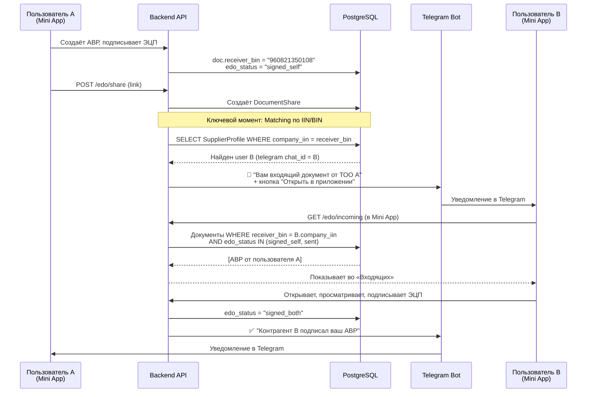
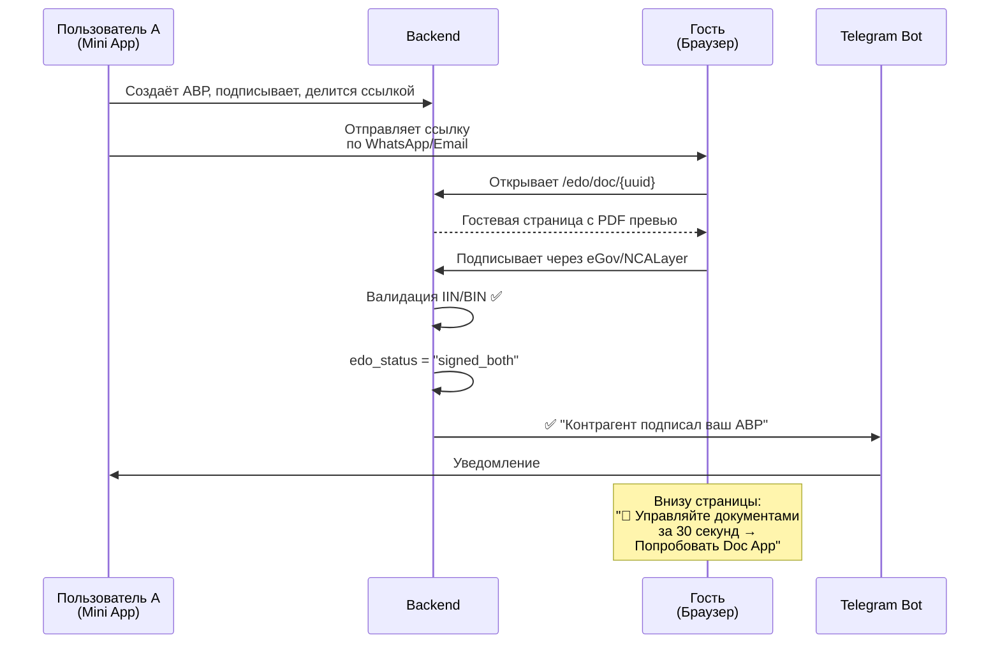
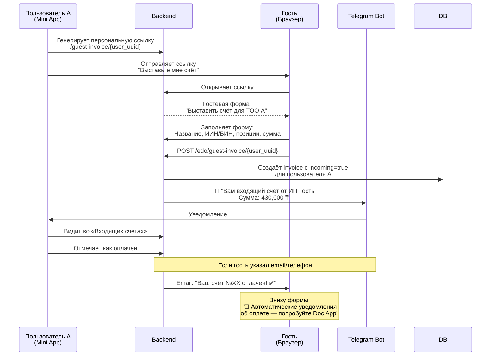
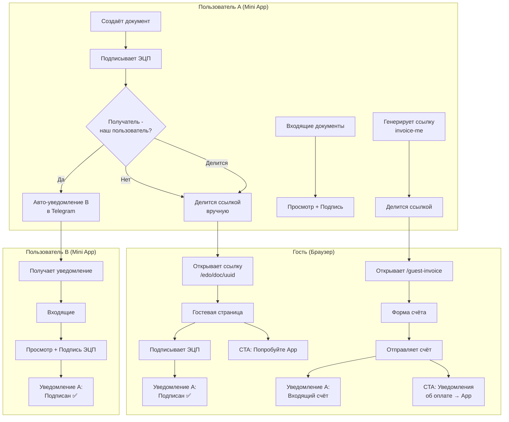

# 📥 Полный план: Входящие документы, Счета через гостевую страницу и UX

> Комплексный анализ и план реализации всей логики входящих документов, гостевых страниц для счетов, Telegram-уведомлений и промо-конверсии.

---

## 📊 Текущее состояние (что уже есть)

### ✅ Реализовано (Фаза 1 + частично Фаза 2)

| Компонент | Статус | Файлы |
|-----------|--------|-------|
| ЭЦП подписание через eGov Mobile (SIGEX) | ✅ Готово | [router.py](file:///home/observer/Projects/new/doc-mini-app/apps/api/src/app/modules/edo/router.py) |
| Гостевая страница `/edo/doc/{uuid}` | ✅ Готово | [guest_page.py](file:///home/observer/Projects/new/doc-mini-app/apps/api/src/app/modules/edo/guest_page.py) |
| Подписание контрагентом через NCALayer | ✅ Готово | guest_page.py (JS WebSocket) |
| Подписание контрагентом через eGov Mobile | ✅ Готово | guest_page.py (sign-mobile endpoint) |
| Штамп ЭЦП на PDF | ✅ Готово | [pdf_stamper.py](file:///home/observer/Projects/new/doc-mini-app/apps/api/src/app/services/pdf_stamper.py) |
| Кнопка «Поделиться» в Mini App | ✅ Готово | [ViewDocumentView.tsx](file:///home/observer/Projects/new/doc-mini-app/apps/miniapp/src/views/ViewDocumentView.tsx#L339-L389) |
| Tabs «Исходящие» / «Входящие» в UI | ✅ UI готов | [InvoicesListView.tsx](file:///home/observer/Projects/new/doc-mini-app/apps/miniapp/src/views/InvoicesListView.tsx#L51) |
| Валидация IIN/BIN при подписании | ✅ Готово | router.py + guest_page.py |
| Telegram уведомления (overdue, paid, sent) | ✅ Готово | [scheduler.py](file:///home/observer/Projects/new/doc-mini-app/apps/api/src/app/core/scheduler.py) |

### ❌ НЕ реализовано (что нужно сделать)

| Компонент | Описание |
|-----------|----------|
| **Входящие документы (backend)** | API для поиска документов, где `receiver_bin` = текущий пользователь |
| **Входящие документы (frontend)** | Вкладка «Входящие» показывает пустое состояние, нет загрузки данных |
| **Telegram уведомление о входящем документе** | Не отправляется уведомление при подписании документа для зарегистрированного получателя |
| **Telegram уведомление о подписи контрагента** | Отправитель не знает, что контрагент подписал документ |
| **Гостевая страница для СЧЕТОВ** | Нет публичной страницы для выставления счёта незарегистрированным пользователем |
| **Обратное выставление счёта** | Гость не может выставить счёт нашему пользователю |
| **CTA «Попробуйте наше приложение»** | На гостевых страницах нет промо-блока |
| **Уведомление об оплате по счёту** | Гость не узнает, что счёт оплачен |

---

## 🏗️ Архитектура: Как это всё работает

### Сценарий 1: Два зарегистрированных пользователя (A и B)



### Сценарий 2: Гость (не зарегистрирован) подписывает документ



### Сценарий 3: Гость выставляет счёт нашему пользователю



---

## 📋 Детальный план реализации

### Блок 1: Входящие документы для зарегистрированных пользователей

#### 1.1 Backend: API endpoint `/edo/incoming`

**Файл**: [edo/router.py](file:///home/observer/Projects/new/doc-mini-app/apps/api/src/app/modules/edo/router.py)

**Логика**: Находим документы, где `receiver_bin` совпадает с `company_iin` текущего пользователя.

```python
@router.get("/incoming")
async def get_incoming_documents(
    user_id: int = Depends(get_current_user_id),
    db: Session = Depends(get_db),
):
    """Get documents that were sent TO the current user (matched by IIN/BIN)."""
    profile = db.query(SupplierProfile).filter(
        SupplierProfile.user_id == user_id
    ).first()
    if not profile or not profile.company_iin:
        return []

    my_iin = profile.company_iin.strip()
    
    # Find documents where receiver_bin matches MY IIN/BIN
    # AND the document was signed by sender (at least signed_self)
    # AND the document is NOT mine (sender is different)
    docs = db.query(Document).filter(
        Document.receiver_bin == my_iin,
        Document.user_id != user_id,  # Not my own docs
        Document.edo_status.in_(["signed_self", "sent", "signed_both", "rejected"]),
    ).order_by(Document.created_at.desc()).limit(100).all()

    return [{
        "id": d.id,
        "title": d.title,
        "sender_name": _get_sender_name(db, d.user_id),
        "sender_bin": _get_sender_bin(db, d.user_id),
        "total_sum": d.total_sum,
        "doc_type": d.doc_type,
        "edo_status": d.edo_status,
        "created_at": d.created_at.isoformat() if d.created_at else "",
        "share_uuid": _get_share_uuid(db, d.id),
    } for d in docs]
```

> [!IMPORTANT]
> Matching работает по `company_iin` из [SupplierProfile](file:///home/observer/Projects/new/doc-mini-app/apps/api/src/app/core/db.py#154-179). Это означает, что оба пользователя должны иметь заполненный ИИН/БИН в профиле. Если `receiver_bin` в документе совпадает с `company_iin` получателя — документ появляется во «Входящих».

#### 1.2 Backend: Incoming invoices API

**Файл**: [invoices/router.py](file:///home/observer/Projects/new/doc-mini-app/apps/api/src/app/modules/invoices/router.py)

```python
@router.get("/incoming")
async def get_incoming_invoices(
    user_id: int = Depends(get_current_user_id),
    db: Session = Depends(get_db),
):
    """Get invoices that were sent TO the current user."""
    profile = db.query(SupplierProfile).filter(
        SupplierProfile.user_id == user_id
    ).first()
    if not profile or not profile.company_iin:
        return []
    
    # Incoming invoices: client_bin matches MY company_iin
    # AND invoice is not mine
    invoices = db.query(Invoice).filter(
        Invoice.client_bin == profile.company_iin.strip(),
        Invoice.user_id != user_id,
    ).order_by(Invoice.created_at.desc()).limit(100).all()
    
    return invoices
```

#### 1.3 Frontend: Загрузка входящих во вкладке

**Файл**: [InvoicesListView.tsx](file:///home/observer/Projects/new/doc-mini-app/apps/miniapp/src/views/InvoicesListView.tsx#L200-L205)

Текущее состояние вкладки «Входящие» — пустой placeholder:
```tsx
{activeTab === "incoming" ? (
    <div className="empty-state full-height">
        <div className="empty-state-icon"><Icon name="inbox" /></div>
        <div className="empty-state-title">Входящие документы отсутствуют</div>
        <div className="empty-state-text">Ожидайте поступления новых документов</div>
    </div>
)
```

**Нужно**: при `activeTab === "incoming"` загружать данные из `/edo/incoming` и отображать их.

#### 1.4 Frontend: Просмотр и подписание входящего документа

Для входящего документа во «Входящих» пользователь:
1. Нажимает на карточку → открывается превью PDF (через `/edo/public/{share_uuid}/pdf-b64`)
2. Видит информацию: кто отправил, сумму, статус подписей
3. Кнопка «Подписать ЭЦП» (как receiver через eGov Mobile)
4. Кнопка «Отклонить» с комментарием

---

### Блок 2: Telegram-уведомления для ЭДО

#### 2.1 Уведомление «Вам входящий документ»

**Файл**: [scheduler.py](file:///home/observer/Projects/new/doc-mini-app/apps/api/src/app/core/scheduler.py) + [edo/router.py](file:///home/observer/Projects/new/doc-mini-app/apps/api/src/app/modules/edo/router.py)

**Когда**: После того как отправитель нажал «Поделиться», ИЛИ после того как документ подписан sender'ом и `receiver_bin` заполнен.

**Логика**:
```python
async def notify_incoming_document(db: Session, document: Document):
    """Notify the receiver via Telegram if they are a registered user."""
    receiver_bin = (document.receiver_bin or "").strip()
    if not receiver_bin:
        return
    
    # Find receiver profile by IIN/BIN
    receiver_profile = db.query(SupplierProfile).filter(
        SupplierProfile.company_iin == receiver_bin
    ).first()
    
    if not receiver_profile:
        return  # Not a registered user
    
    receiver_user_id = receiver_profile.user_id
    
    # Don't notify yourself
    if receiver_user_id == document.user_id:
        return
    
    # Check notifications are enabled
    if not receiver_profile.notifications_enabled:
        return
    
    # Get sender info
    sender_profile = db.query(SupplierProfile).filter(
        SupplierProfile.user_id == document.user_id
    ).first()
    sender_name = sender_profile.company_name if sender_profile else "Неизвестный"
    
    msg = (
        f"📩 <b>Входящий документ</b>\n\n"
        f"От: <b>{sender_name}</b>\n"
        f"Документ: <code>{document.title}</code>\n"
        f"Сумма: <b>{document.total_sum} ₸</b>\n\n"
        f"Откройте приложение для просмотра и подписания."
    )
    
    bot = TelegramBotClient()
    try:
        await bot.send_message(chat_id=receiver_user_id, text=msg)
    finally:
        await bot.close()
```

#### 2.2 Уведомление «Контрагент подписал ваш документ»

**Когда**: После сохранения подписи receiver'а (в [_poll_and_save_signature](file:///home/observer/Projects/new/doc-mini-app/apps/api/src/app/modules/edo/router.py#449-601) и [save_guest_signature](file:///home/observer/Projects/new/doc-mini-app/apps/api/src/app/modules/edo/guest_page.py#687-774)).

```python
async def notify_document_signed(db: Session, document: Document, signer_name: str):
    """Notify document owner that counterparty signed."""
    owner_id = document.user_id
    
    profile = db.query(SupplierProfile).filter(
        SupplierProfile.user_id == owner_id
    ).first()
    if profile and not profile.notifications_enabled:
        return
    
    msg = (
        f"✅ <b>Документ подписан контрагентом!</b>\n\n"
        f"Документ: <code>{document.title}</code>\n"
        f"Подписант: <b>{signer_name}</b>\n"
        f"Сумма: <b>{document.total_sum} ₸</b>\n\n"
        f"Документ подписан обеими сторонами. PDF со штампом ЭЦП обновлён."
    )
    
    bot = TelegramBotClient()
    try:
        await bot.send_message(chat_id=owner_id, text=msg)
    finally:
        await bot.close()
```

#### 2.3 Уведомление «Документ отклонён»

```python
async def notify_document_rejected(db: Session, document: Document, comment: str):
    """Notify document owner that counterparty rejected."""
    msg = (
        f"❌ <b>Документ отклонён контрагентом</b>\n\n"
        f"Документ: <code>{document.title}</code>\n"
        f"Причина: {comment or 'Не указана'}\n\n"
        f"Создайте новый документ в приложении."
    )
    bot = TelegramBotClient()
    try:
        await bot.send_message(chat_id=document.user_id, text=msg)
    finally:
        await bot.close()
```

---

### Блок 3: Гостевая страница для счетов

#### 3.1 Персональная ссылка профиля

Каждый пользователь получает уникальную ссылку-визитку:
```
https://api.doc.onlink.kz/edo/invoice-me/{profile_uuid}
```

**DB**: Добавить поле `profile_uuid` в [SupplierProfile](file:///home/observer/Projects/new/doc-mini-app/apps/api/src/app/core/db.py#154-179) (UUID, генерится при создании).

#### 3.2 Гостевая форма «Выставить счёт»

**Файл**: новый `edo/guest_invoice_page.py`

Гость открывает ссылку → видит форму:
```
┌─────────────────────────────────────────┐
│  🏢 Выставить счёт для:               │
│  ТОО "Компания А" (БИН: 140240030432) │
│                                         │
│  ── Ваши данные ──                      │
│  Название компании: [ ______________ ]  │
│  ИИН/БИН:          [ ______________ ]  │
│  Email (опц.):     [ ______________ ]  │
│  Телефон (опц.):   [ ______________ ]  │
│                                         │
│  ── Позиции счёта ──                    │
│  Наименование      Кол  Цена   Итого   │
│  [_______________]  [1]  [___]  [___]   │
│  + Добавить позицию                     │
│                                         │
│  Итого: 430,000 ₸                       │
│                                         │
│  ┌──────────────────────────────┐       │
│  │  📤 ОТПРАВИТЬ СЧЁТ          │       │
│  └──────────────────────────────┘       │
│                                         │
│  ──────────────────────────────         │
│  📱 Получайте уведомления об оплате    │
│  автоматически — попробуйте Doc App →  │
│  [Начать бесплатно]                     │
└─────────────────────────────────────────┘
```

#### 3.3 Backend: Приём счёта от гостя

```python
@router.post("/guest-invoice/{profile_uuid}")
async def submit_guest_invoice(
    profile_uuid: str,
    payload: GuestInvoicePayload,
    db: Session = Depends(get_db),
):
    """Create an incoming invoice for a registered user from a guest."""
    profile = db.query(SupplierProfile).filter(
        SupplierProfile.profile_uuid == profile_uuid
    ).first()
    if not profile:
        return JSONResponse({"success": False}, status_code=404)
    
    # Create invoice AS incoming for the target user
    inv = Invoice(
        user_id=profile.user_id,
        number=f"ВХОД-{uuid4_hex()[:6].upper()}",
        client_name=payload.sender_name,
        client_bin=payload.sender_bin,
        total_amount=payload.total,
        status="incoming",  # New status: incoming
        # ... other fields
    )
    db.add(inv)
    db.commit()
    
    # Notify via Telegram
    await notify_incoming_invoice(db, profile.user_id, inv, payload.sender_name)
    
    return {"success": True, "invoice_number": inv.number}
```

---

### Блок 4: CTA «Попробуйте наше приложение»

#### 4.1 На гостевой странице документа (после подписания)

```html
<!-- В guest_page.py, в footer и после showSuccess() -->
<div class="promo-card">
    <div class="promo-icon">📱</div>
    <h3>Управляйте документами за 30 секунд</h3>
    <p>Выставляйте счета, подписывайте документы ЭЦП 
       и получайте уведомления — всё в одном приложении</p>
    <a href="https://t.me/DocOnlinkBot" class="btn btn-promo">
        Начать бесплатно в Telegram
    </a>
</div>
```

#### 4.2 На гостевой странице счёта (после отправки)

```html
<div class="success-promo">
    <h3>✅ Счёт отправлен!</h3>
    <p>Хотите узнать, когда его оплатят?</p>
    <p><strong>В Doc App</strong> вы получите Telegram-уведомление 
       автоматически, когда клиент отметит оплату.</p>
    <a href="https://t.me/DocOnlinkBot" class="btn btn-promo">
        📱 Попробовать Doc App
    </a>
</div>
```

---

### Блок 5: Автоуведомление об оплате счёта

#### 5.1 Для гостя (по email)

При создании incoming invoice, если гость указал email:
- Когда пользователь отмечает счёт как оплаченный → отправлять email гостю
- Или показывать на специальной странице `/invoice-status/{uuid}`

#### 5.2 Для зарегистрированного пользователя

Если входящий счёт оплачен → Telegram уведомление отправителю.

---

## 🔄 Порядок реализации (по приоритету)

| # | Задача | Сложность | Время |
|---|--------|-----------|-------|
| **1** | **Backend: `/edo/incoming` API** | Средняя | 20 мин |
| **2** | **Frontend: Загрузка «Входящих» в InvoicesListView** | Средняя | 30 мин |
| **3** | **Frontend: Просмотр + подписание входящего** | Средняя | 30 мин |
| **4** | **Telegram: Уведомление о входящем документе** | Лёгкая | 15 мин |
| **5** | **Telegram: Уведомление о подписи контрагента** | Лёгкая | 15 мин |
| **6** | **Telegram: Уведомление об отклонении** | Лёгкая | 10 мин |
| **7** | **CTA «Попробуйте» на гостевых страницах** | Лёгкая | 15 мин |
| **8** | **DB: `profile_uuid` в SupplierProfile** | Лёгкая | 10 мин |
| **9** | **Guest Invoice Page (форма)** | Высокая | 1 час |
| **10** | **Guest Invoice Backend** | Средняя | 30 мин |
| **11** | **Email/статусная страница оплаты** | Средняя | 30 мин |

**Общее время**: ~4-5 часов

---

## 🧪 Как тестировать

### Тест 1: Два зарегистрированных пользователя

**Предусловия**:
- Пользователь A: `company_iin = "140240030432"` (ТОО)
- Пользователь B: `company_iin = "960821350108"` (ИП)

**Шаги**:
1. **A** создаёт АВР для клиента с `CLIENT_IIN = "960821350108"`
2. **A** подписывает ЭЦП → статус `signed_self`
3. **A** нажимает «Поделиться» → генерируется share link
4. **Система** автоматически отправляет уведомление **B** в Telegram:
   > 📩 Входящий документ от ТОО "Компания A"
   > АВР-001, сумма: 430,000 ₸
5. **B** открывает Mini App → вкладка «Входящие» → видит АВР
6. **B** открывает → просмотр PDF → нажимает «Подписать ЭЦП»
7. **B** подписывает через eGov Mobile → статус `signed_both`
8. **Система** отправляет уведомление **A** в Telegram:
   > ✅ Контрагент подписал ваш АВР-001! Документ подписан обеими сторонами.

### Тест 2: Гость подписывает через ссылку

1. **A** подписывает, делится ссылкой
2. Открываем ссылку в браузере (или другом телефоне)
3. Видим красивую гостевую страницу
4. Подписываем через eGov Mobile или NCALayer
5. **A** получает уведомление в Telegram

### Тест 3: Гость выставляет счёт

1. **A** копирует свою ссылку `/guest-invoice/{uuid}`
2. Открываем в браузере
3. Заполняем форму: название компании, ИИН, позиции, сумму
4. Нажимаем «Отправить»
5. **A** получает уведомление:
   > 📩 Входящий счёт от ИП Гость, сумма: 150,000 ₸
6. **A** видит счёт во «Входящих счетах»
7. **A** отмечает как оплачен
8. Гость получает email (если указал): «Ваш счёт оплачен ✅»

---

## 🎯 UX Flow Summary



---

## ⚠️ Критические заметки

> [!WARNING]
> **Matching по IIN/BIN** — основа всей системы входящих. Если у пользователя не заполнен `company_iin` в профиле, он не сможет получать входящие документы. Нужно добавить проверку и уведомление при пустом IIN.

> [!IMPORTANT]
> **Безопасность**: Во «Входящих» пользователь видит только документы, но НЕ может их редактировать или удалять (он — receiver, не owner). Подписать или отклонить — всё, что он может.

> [!TIP]
> **profile_uuid** для гостевой ссылки счёта должен быть UUID v4, чтобы его нельзя было угадать. Не используйте [user_id](file:///home/observer/Projects/new/doc-mini-app/apps/api/src/app/core/scheduler.py#29-33) или `company_iin` напрямую.

---

## Начинаем?

Рекомендую начать с **Блоков 1-2** (Backend API + Frontend «Входящие»), потом **Блок 3** (Telegram уведомления), и в конце **Блоки 4-5** (Гостевые страницы для счетов + CTA).
